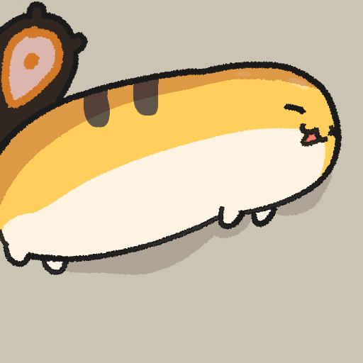

<!--
**nicknmi/nicknmi** is a ✨ _special_ ✨ repository because its `README.md` (this file) appears on your GitHub profile.

Here are some ideas to get you started:

- 🔭 I’m currently working on ...
- 🌱 I’m currently learning ...
- 👯 I’m looking to collaborate on ...
- 🤔 I’m looking for help with ...
- 💬 Ask me about ...
- 📫 How to reach me: ...
- 😄 Pronouns: ...
- ⚡ Fun fact: ...
-->

# Hey! 👋
I'm an aspiring embedded software engineer, but I'm open to doing anything related with computers! I'm currently working on Nand2Tetris, a course where you build a high level programming language from first principles, from the simple NAND gate to a Java-like programming language. Other than that, I just do random stuff when I feel like it! (like LeetCode)

Come check out some of my personal favorite projects:

## [Nand2Tetris](https://github.com/nicknmi/Nand2Tetris)
Building a Von Neumann computer and everything inside it starting from a NAND gate, to building up to a Multiplexor, to a register, to the RAM and ALU. After that, I built a 16-bit Hack assembler that converts ASM into binary that can be understood by the ALU. One more level up is the VM Translator, an intermediate language that can work across different hardware platforms (JVM-like). Currently working on the compiler.

## [SnapFridge](https://github.com/SnapFridge/SnapFridge)
A full-stack project where a user can take a single picture of their fridge, and an AI model catalogues everything inside it (including quantity!) for the user. Also suggests recipes that the user can try based on the ingredients available to them. Inspired by the copious amount of food waste out there, so we built a tool to help combat that.

## [Line Following Robot](https://github.com/jaydenlu997/SPIS-Robotics-Final-Project-2026)
A physical robot that is built to follow lines, turns, and intersections placed on the ground! Inspired by the Micromouse. Uses a visual camera (Picamera) and OpenCV to detect lines, turns, and intersections. Runs on the Raspberry Pi 4 (4GB) with DC motors.

  <figure>
    
     
    Original by <a href="https://x.com/DailyGremPyro">Daily Grem Guy</a> on X (formerly Twitter)
  </figure>

